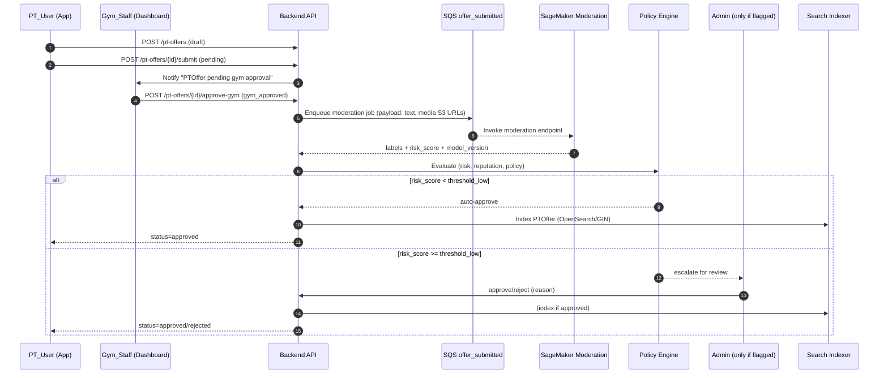
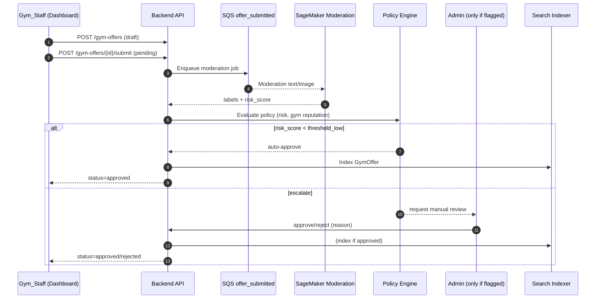
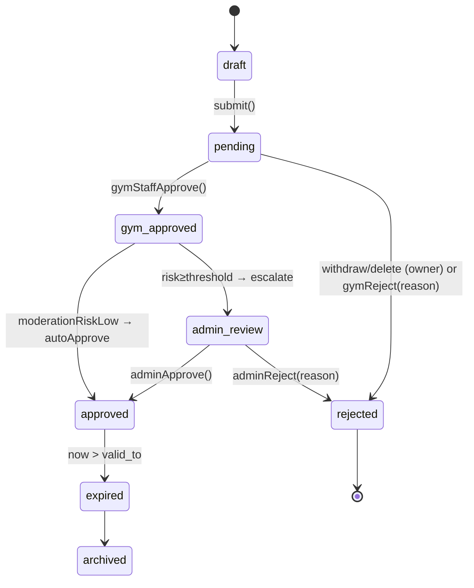
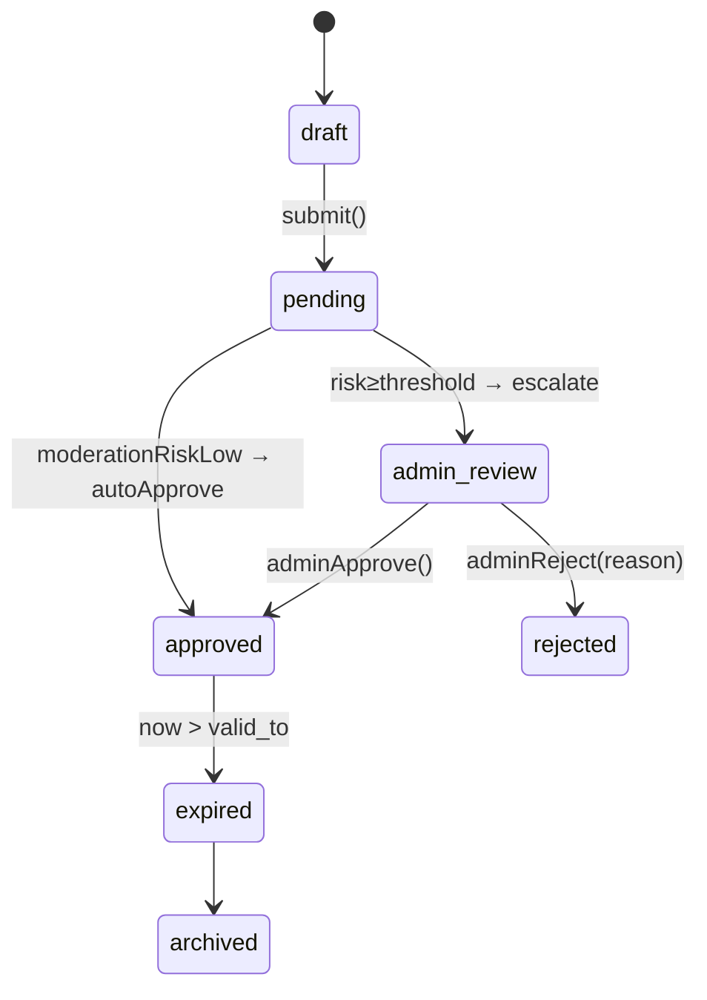

# 📦 Easy Body — Flow & Layout Spec (v1)

> Deliverable includes **two files** inside this spec:
>
> * `FLOW.md` — duyệt Offer & moderation pipeline (swimlane + state machine + events)
> * `LAYOUT.md` — cấu trúc màn hình, component tree, routing, dữ liệu tối thiểu
>
> Stack target: **Next.js (TS)** + **Spring Boot** + **AWS** (Cognito, S3, CloudFront, SQS, Lambda, RDS Postgres + PostGIS, SageMaker/Bedrock, OpenSearch), CI/CD GitHub Actions.

---

## FILE: `FLOW.md`

### 0) Scope

* Roles: **Client**, **PT_User (PT)**, **Gym_Staff**, **Admin**, **SageMaker Moderation** (text/image), **System (Policy Engine / Indexer)**.
* Flows: **PT Offer**, **Gym Offer**, **Report → Re‑review**, **Expire**.
* Outputs: state transitions, events, API points.

---

### 1) Swimlane — PT Offer

---

### 2) Swimlane — Gym Offer

---

### 3) State Machines (rút gọn)

**PTOffer**

**GymOffer**

---

### 4) Events & Queues

* **SQS `offer_submitted`**: `{offerType, offerId, gymId, ptUserId?, title, mediaKeys[], locale}`
* **EventBridge `offer.moderated`**: `{offerType, offerId, riskScore, labels[], modelVersion}`
* **SNS email/push**: notify creator, Gym_Staff, Admin if escalate or rejected.
* **DLQ**: moderation failures.

---

### 5) API Endpoints (rút gọn để code)

* **PT Offers**

  * `POST /pt-offers` → create draft
  * `POST /pt-offers/{id}/submit`
  * `POST /pt-offers/{id}/approve-gym` (Gym_Staff)
  * `POST /pt-offers/{id}/reject` (Gym_Staff/Admin) {reason}
  * `GET /pt-offers?gym_id&status&q&lat&lon&radius&price_min&price_max`
* **Gym Offers**

  * `POST /gym-offers` → create draft
  * `POST /gym-offers/{id}/submit`
  * `POST /gym-offers/{id}/reject` (Admin when escalated)
  * `GET /gym-offers?gym_id&status&q&lat&lon&radius`
* **Moderation Queue**

  * `GET /moderation/queue?flagged_only=true`
  * `POST /offers/{type}/{id}/admin-approve|admin-reject`
* **Reports**

  * `POST /reports` {offerType, offerId, reason}
  * `GET /reports?status=open`

---

### 6) Policy & Thresholds (starter)

* `threshold_low = 0.35`, `threshold_high = 0.75` (tùy model scale)
* Auto‑reject nếu label thuộc nhóm **cấm** (NSFW explicit, scam, hateful terms…)
* **Reputation boost**: gym/pt có score cao → trừ 0.05–0.1 risk.
* **Penalty**: tài khoản có strikes gần đây → +0.05–0.15 risk.

---

# Xem thêm: cấu trúc màn hình, component tree, routing chi tiết ở `LAYOUT.md`.
